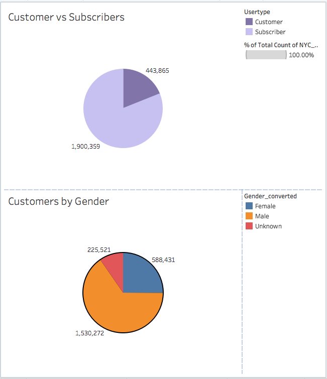
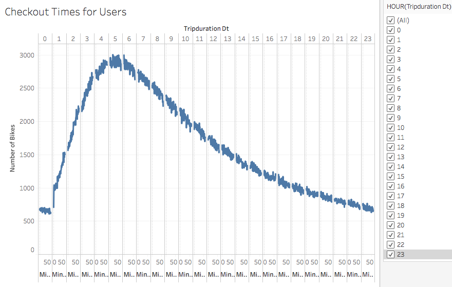
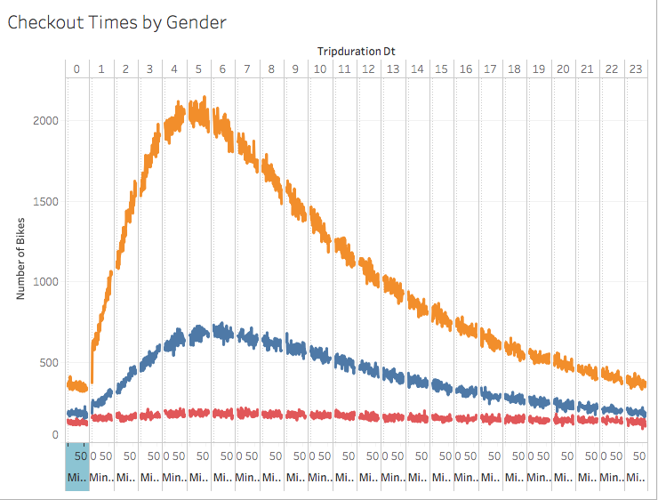
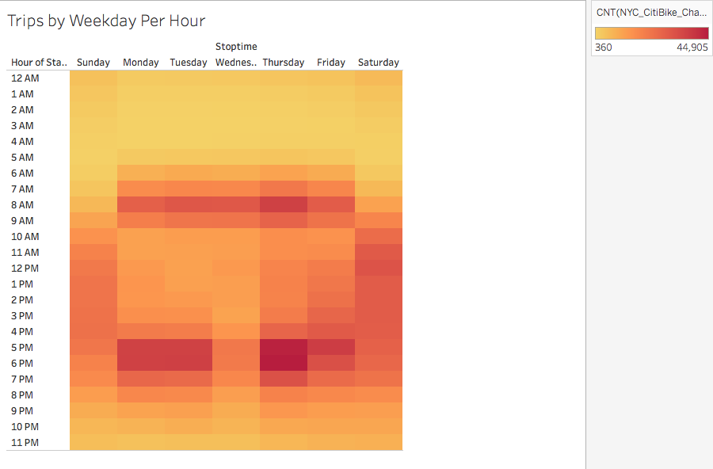
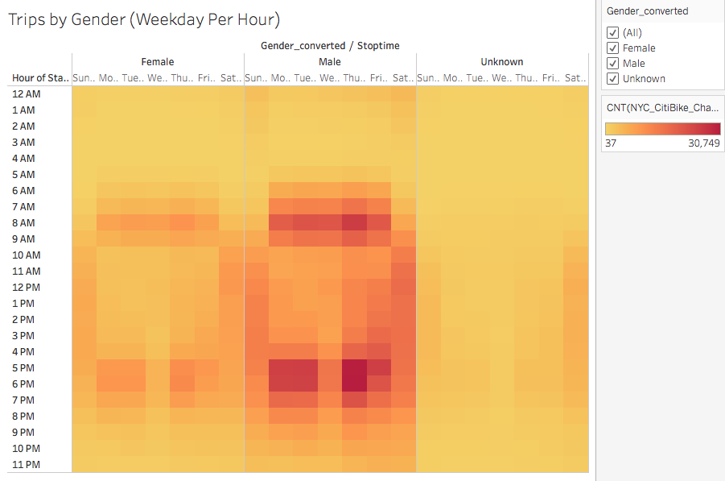
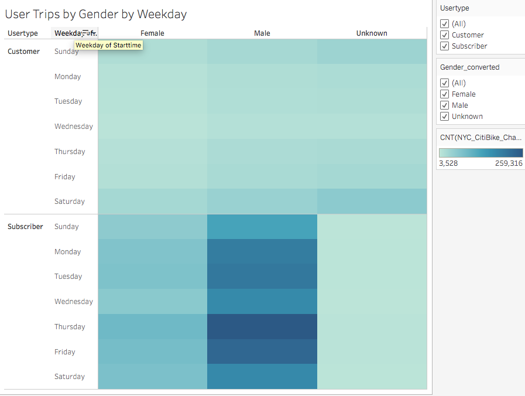

# Des Moines Bike-Sharing Proposal

## Overview

The following is an analysis of Citibike data from New York City for the month of August 2019. This analysis was made to realize possible business strategies for the proposed bike-sharing company based in Des Moines, Iowa. Among metrics analysed were the length of rides throughout the day by various riders and the number of bike trips by day of the week for various riders. 

## Results 

Interactive versions of all of the following graphics can be found at [this link](https://public.tableau.com/shared/NCH6J47C7?:display_count=y&:origin=viz_share_link).

### Citibike Rider Breakdown

Citibike riders can be categorized by whether they are regular customers or subscribers, and by their gender. As both distinctions inform the analysis to follow, the breakdown of riders by customer type and by gender are shown below. 

As can be seen above, the vast majority of Citibike riders are subscribers (81.07% vs 18.93%). Furthermore, the majority of Citibike riders are male (65.28% vs 25.10% female).

### Trip Length 

One important factor in understanding bike-share usage is trip length. In the graphic shown below, that number of bikes increased with trip duration up to about the fifth hour, and from six hours onward the number of bikes used for such trips decreased steadily.

When trip length is broken down by gender, it can be seen that female ridership and male ridership generally track each other, though the curve in male ridership is slightly more steep, indicating a larger discrepancy between male ride times. For riders of unknown gender, the number of rides seem to be roughly the same for every trip length from zero to 24 hours. 

### Trips by Weekday 

The following heat map shows the most popular times for Citibike users broken down by day of the week and then further by hour. It can be seen that the most popular time to use a Citibike is weekdays during work commute times, approximately 6am-9am and 4pm-7pm. Weekends 9am to 7pm are almost equally as popular. There is very little usage between midnight and 6am, making this time an ideal time for repairs. 

When users are categorized by gender, it can be seen that ridership patterns between genders are relatively similar. One noted difference may be that male usage, in addition to being greater over all, continues later into the night and potentially starts earlier than female useage. The chart also shows that riders of unknown gender ride more on the weekends than weekdays. 

When broken down by user type, it can be seen that one-time customers are more likely to be weekend riders than weekday commuters. Subscribers are in greater numbers weekday commuters, and their usage patterns are generally consistent between males and females. Riders who do not wish to report their gender are more often one-time customers than subscribers and are generally riding on the weekend. 

## Summary

### Trip Length

As shown above, more bikes were used for trips around five hours than any other trip length. As the workday for most people is longer than five hours, it may be concluded that many of these five hour trips are made as weekend rides. One useful future analysis would be to analyze trip length by day of the week, in addition to by gender, to determine whether this assumption is true and to identify possible opportunities to incentivise a certain type of ride. For example, if most five hour rides are indeed taken on the weekend, creating a route with lists of sights and activities in Des Moines designed to take five hours could encourage this type of trip. This may be more important in a city such as Des Moines, which is vastly smaller than New York City. At the core of this issue is the question of what is the optimal ride length in terms of profit per ride, and more analysis should be made in this realm as well.  

### Gender Breakdown and the Importance of Female Ridership 

From the analysis above, it can be understood that temporal usage patterns for males and females are roughly the same, with trip lengths of around five hours being the most popular and with weekends and weekday commuting times being the most popular time to take out a bike. It should be noted however, that bike-share users are much more likely to be male. Marketing should reflect this knowledge by ensuring to get the attention of potential male users, but it can also be leveraged to increase female ridership. Furthermore, safety features could be implemented on the bikes to make female riders feel safer, as the analysis shows that female riders are less likely to take out a bike in the late hours of night or the early morning. Increasing female ridership should be a major goal, as increased female ridership could help account for the difference in population between New York and Des Moines. Additional visualizations should be made to identify whether males or females are more likely to be subscribers, as getting more females to subscribe may be a useful tactic in increasing female ridership. 

